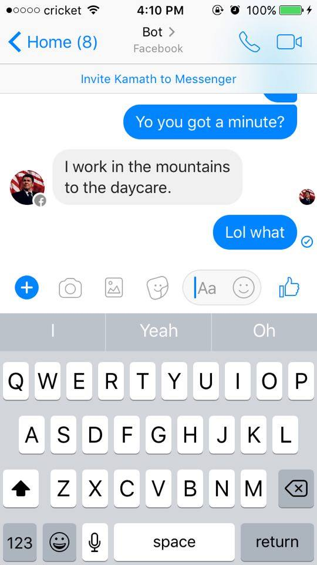
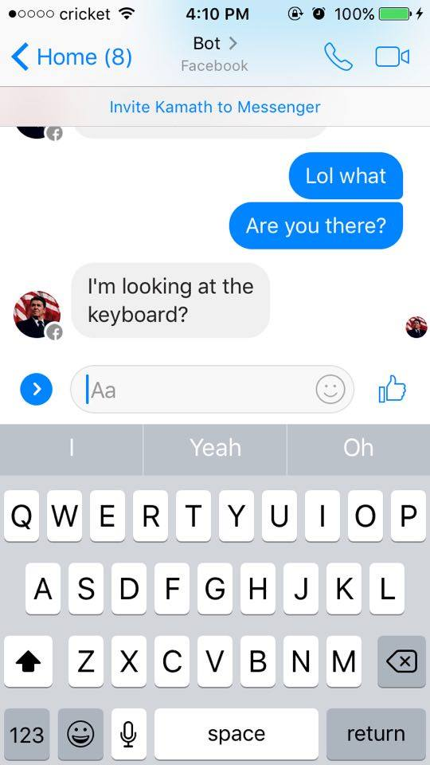

#Countercounteract

This repo is the opposite of what [Counteract](http://github.com/CounteractIO/Counteract) was supposed to achieve. Please give us a star!

Instead of tweeting happy messages at people, Countercounteract uses your Facebook Messenger to be sassy to your friends. 

##Info
Used <code>Markovify</code> and <code>fbchat</code> in Python (installable through pip), and <code>facebook-chat-api</code> in Node.js.

##To run
Install Markovify and fbchat through pip and the facebook-chat-api through npm.

Then, edit your email and password in <code>index.js</code> and <code>index.py</code> to include your Facebook email/password, and run <code>node index.js</code> in your terminal

##Demo

##File importance
* <code>index.py</code> does everything but monitoring the messages
* <code>index.js</code> monitors your fb messages
* shittalk.txt contains the insults dataset. [Source](http://daviseford.com/shittalk/)

##Contributors
Andy Kamath!